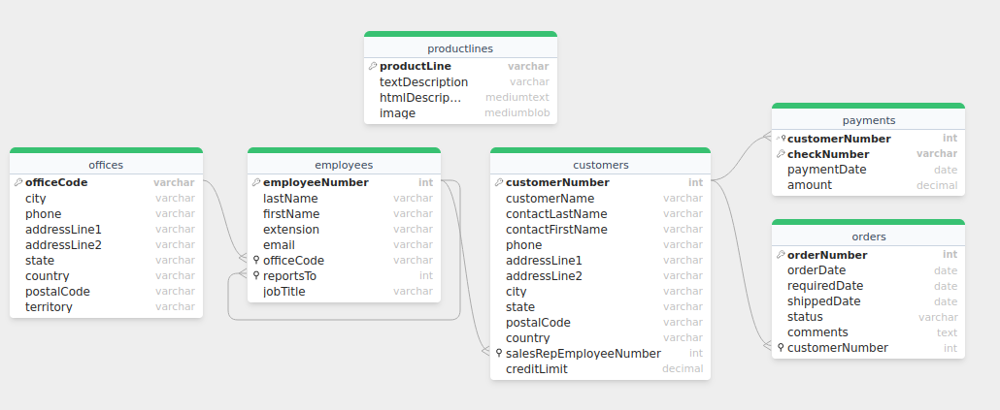
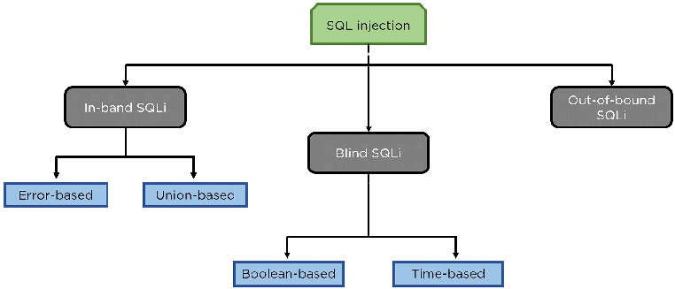
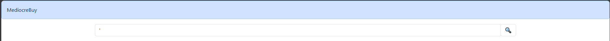
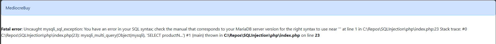
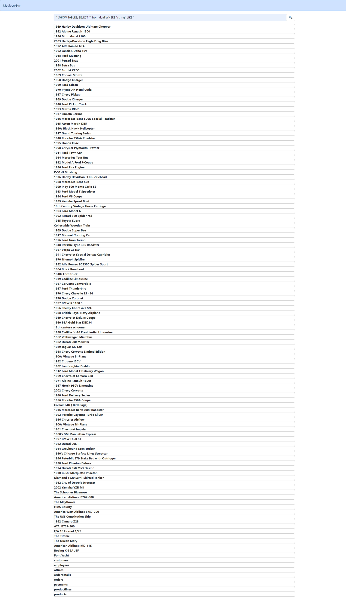
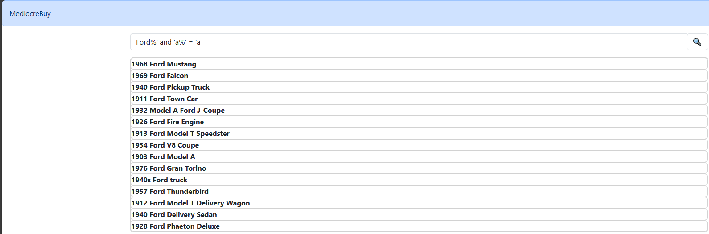
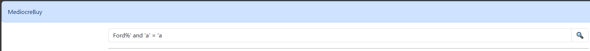
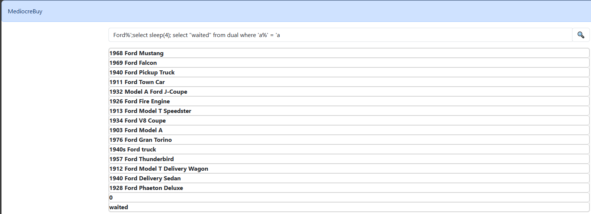

# Wstęp

Niniejsze sprawozdanie jest raportem będącym wynikiem badań nad atakami typu **SQL Injection**, przeprowadzonego
w ramach projektu na przedmiod Projektowanie systemów bezpieczeństwa. Zdecydowaliśmy się wykonać
cały projekt z wykorzystaniem oprogramowania XAMPP które umożliwia nam postawienie serwera apache,
bazy danych MariaDB i interpretowanie skryptów w języku PHP.

Do wykonania ataków napisaliśmy prostą stronę z wykorzystaniem języka PHP która pozwala nam na wykonywanie
zapytań do naszej bazy. Sama truktura bazy wygląda następująco:



Całość projektu zdecydowaliśmy się skonteneryzować z wykorzystaniem Docker'a dla łatwiejszego 
urochamiania całej aplikacji.

# Opis rodzaju ataku

Atak SQL Injection polega na wstrzyknięciu, czyli wstawieniu złośliwego kodu SQL w taki sposób, aby serwer go wykonał. Główną zaletą tego typu ataków dla atakującego jest brak konieczności uzyskania danych autoryzacyjnych serwera SQL - używane jest połączenie utworzone przez serwer lub interfejs usługi.

Możemy wyróżnić kilka podstawowych rodzajów ataku SQLi:
 
 - In-band SQLi
    - Error based
    - Union based
 - Inferential (Blind) SQLi
    - Boolean based
    - Time based
- Out-of-band SQLi



## In-band SQLi
In-band SQL injection możemy rozróżnić na dwia typy ataków:

- ***Error based*** - atakujący swoim atakiem prowadzi do wyprodukowania wiadomości błędu przez bazę danych, informacje wyświetlone w wiadomości mogą posłużyć do dalszych ataków ze względu na potencjalne odsłonięcie informacji o strukturze bazy.


### Przykładowe składnie Error based:
```
 ' 
 ''
 OR 1=1
 OR 1=0
 OR 3409=3409 AND ('pytW' LIKE 'pytW
 OR 3409=3409 AND ('pytW' LIKE 'pytY
 HAVING 1=0--
 ORDER BY 9-- 
 ORDER BY 31337#
```
- ***Union based*** - w przypadku tego typu ataków wykorzystuje się słabość operatora UNION, który łączy ze sobą wyniki kilku zapytań w jeden wynik.


### Przykładowe składnie Union based:
```
UNION ALL SELECT USER()-- 
UNION ALL SELECT 1
SELECT a, b FROM table1 UNION SELECT c, d FROM table2
' UNION SELECT username || '~' || password FROM users--
```
## Inferential (Blind) SQLi

- ***Boolen based*** - polega na wstrzyknięciu i modyfikacji zapytania w taki sposób, aby baza danych zwróciła wartość TRUE albo FALSE.



### Przykładowe składnie Boolen based:
```
WHERE ID = 2 and 1=2
WHERE ID = 2 and 1=1
WHERE username = '[username]' AND password = '[password]'
WHERE username = '[username]' AND password = '' OR 1=1'
or 'a'='b' --
```
- ***Time based*** - polega na wysłaniu zapytania do bazy oraz wymuszonego oczekiwania pewniego przedziału czasu na reakcję bazy. Na podstawie czasu potrzebnego na odpowiedź z bazy atakujący może stwierdzić czy zapytanie jest prawdziwe lub fałszywe.

### Przykładowe składnie Time based:
```
WAITFOR DELAY '0:0:30'--
sleep(4)
1 or sleep(5)
ORDER BY SLEEP(5)
AnD SLEEP(5)
waitfor delay '0:0:5'--
```

## Out-of-band SQLi

Przeprowadzenie tego typu ataku wymaga spełnienia pewnych kryteriów(takich jak działanie pewnych funkcji bazy danych). Jest alternatywą do poprzednich ataków stosowaną, gdy serwer jest zbyt wolny lub niestabilny. Opiera się na zdolności tworzenia żądań DNS lub HTTP w celu przesłania danych.

# Podatność na atak

Na atak typu SQL Injection podatne są usługi, które udostępniają użytkownikowi możliwość wysłania tekstu do serwera, który jest bezpośrednio wstawiany do zapytania SQL bez wcześniejszej normalizacji. Przykładem takiego wrażliwego punktu jest wyszukiwarka na stronie internetowej sklepu.

# Potencjalne ryzyko dla ofiary ataku

Baza danych jest kluczowym elementem większości aplikacji internetowych oraz głównym sposobem przechowywania trwałych informacji. Możliwość swobodnego wykonywania zapytań SQL może zapewnić atakującemu dostęp do wszystkich informacji w bazie danych w zależności od uprawnień konta, za pomocą którego serwer łączy się z nią.

# Uruchomienie
Wystarczy uruchomić compose Dockera, wtedy nasz obraz zostanie pobrany z ogólnodostępnego repozytorium i uruchomiony.
```console
sudo docker compose up
```
Strona projektu jest dostępna pod adresem: ***localhost:41062***,

Lub za pomocą ssh: ***port 41061***